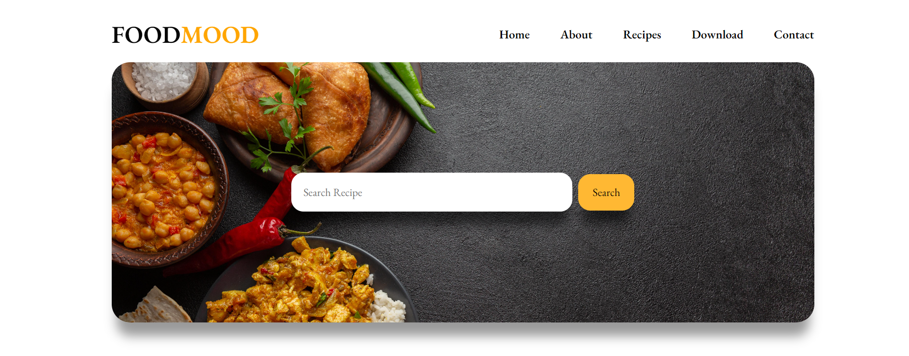
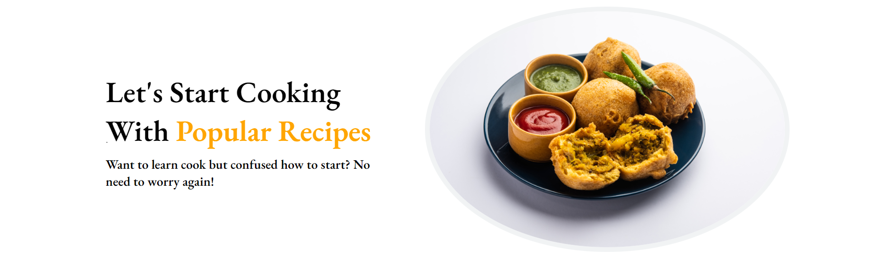
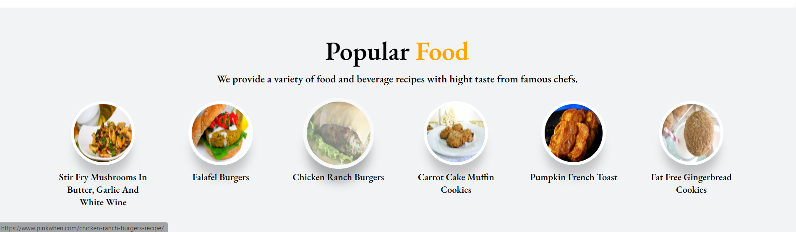
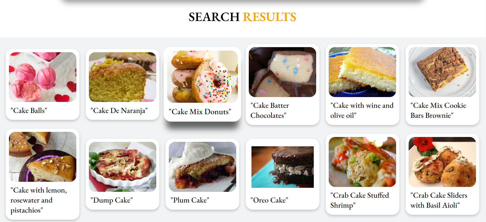
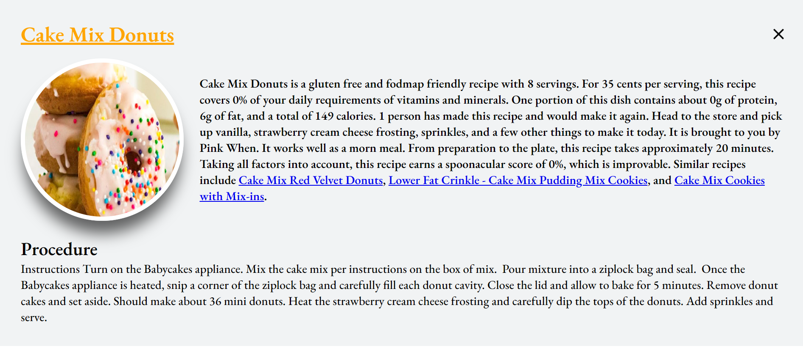

# FOOD MOOD 

A FOOD RECIPE app based on spoonacular API, that gives the RECIPE DETAILS OF DIFFERENT MEALS.

## Live Link
[CLick Here➡️](https://tangerine-pasca-2c9b8e.netlify.app/)

## Features

- Completely responsive UI
- An input for users to type MEAL/DISH NAME.
- Max 12 Meals to be displayed.
- Detailed Instruction and Summary of Meals.
- Popular Dishes Section.

## Tech Stack👩‍💻

- HTML
- CSS
- Vanilla js
- Fetch API

## Sample Images

